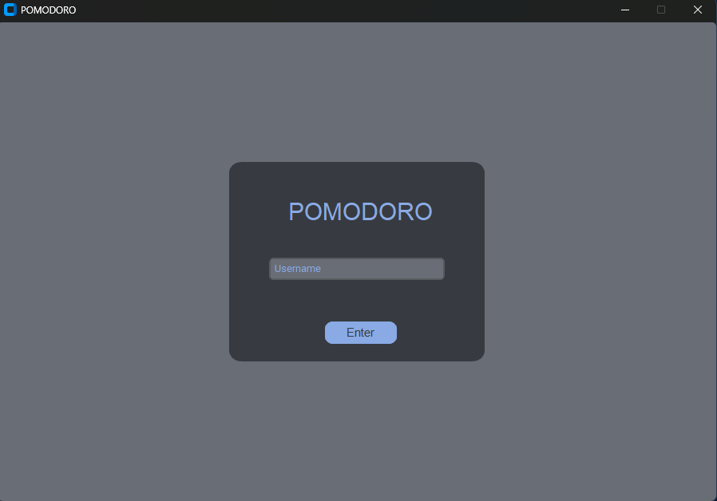
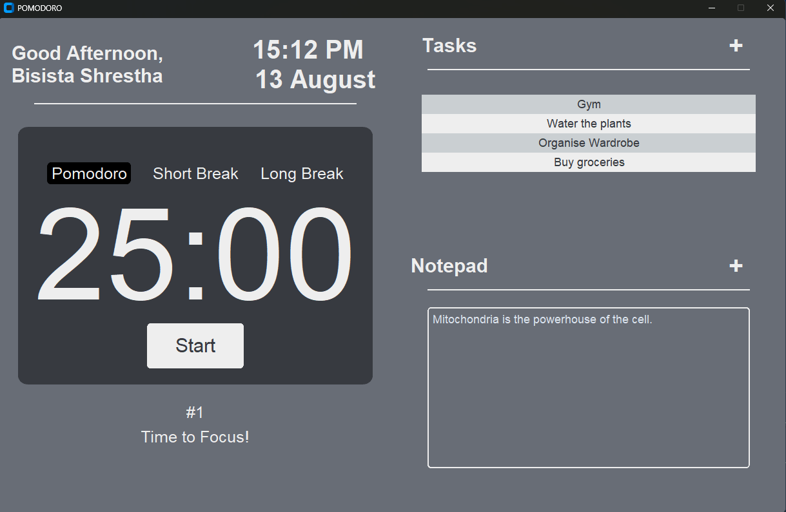

# 🍅 Pomodoro Productivity App

A desktop productivity application built with **Python and CustomTkinter** that combines a Pomodoro timer, task manager, and personal notepad into a single workspace.

|  |
|:--:|
| *Login Page* |


|  |
|:--:|
| *Home Page* |

*[🎥 Watch The Full Demo on YouTube!](https://youtu.be/JJSbInN03TY)*

---

## 📌 Overview

The **Pomodoro Productivity App** is designed to help users stay focused and organized while studying or working.

Instead of switching between separate applications for timing focus sessions, managing tasks, and taking notes, everything is available in one simple desktop interface.

The application supports **multiple users**, stores their tasks and notes locally, and keeps track of completed Pomodoro sessions.

---

## ✨ Features

### 🍅 Pomodoro Timer

* 25-minute focused work sessions
* 5-minute short breaks
* 15-minute long breaks
* Automatic transition between focus and break sessions
* Pause and resume functionality
* Pomodoro session counter

### ✅ Task Manager

* Add new tasks
* Edit existing tasks
* Delete tasks
* Store task descriptions
* Persistent task storage

### 📝 Notepad

* Write and save personal notes
* Notes are stored separately for each user
* Notes persist between application sessions

### 👤 Multi-User Support

* Users can enter their own username
* Each user has their own tasks and notes
* Existing user data is automatically loaded

### 💾 Local Data Persistence

* Tasks and notes are saved locally in `data.db`
* User data remains available after restarting the application

### 🎨 User Interface

* Desktop GUI built with **CustomTkinter**
* Integrated task manager, notepad, and timer
* Dynamic greeting based on the current time

---

## 🛠️ Tech Stack

* **Python**
* **CustomTkinter** — GUI
* **Tkinter** — additional GUI components
* **CTkTable** — task table
* **Threading** — timer execution
* **Pickle** — local data persistence

---

## 📂 Project Structure

```text
Pomodoro-Tools-App/
│
├── main.py
├── requirements.txt
├── data.db
├── LICENSE
└── README.md
```

> `data.db` is created/used locally by the application to store user data.

---

## 🚀 Installation

### 1. Clone the repository

```bash
git clone https://github.com/bisistashrestha/Pomodoro-Tools-App.git
```

### 2. Navigate to the project directory

```bash
cd Pomodoro-Tools-App
```

### 3. Create a virtual environment

```bash
python -m venv myenv
```

### 4. Activate the virtual environment

**Windows:**

```bash
myenv\Scripts\activate
```

**Linux/macOS:**

```bash
source myenv/bin/activate
```

### 5. Install dependencies

```bash
pip install -r requirements.txt
```

---

## ▶️ Running the Application

Run:

```bash
python main.py
```

Enter a username to access the productivity dashboard.

From there you can:

1. Start a Pomodoro focus session.
2. Take short or long breaks.
3. Add and manage tasks.
4. Write and save notes.
5. Track completed Pomodoro sessions.

---

## 🎥 Demo

See the application in action:

**[▶️ Watch the Pomodoro Productivity App Demo](https://youtu.be/JJSbInN03TY)**

---

## 📸 Application

The application provides a single dashboard containing:

* Pomodoro timer
* Focus/break controls
* Task manager
* Personal notepad
* User greeting
* Pomodoro session counter

---

## 💡 What I Built

This project gave me hands-on experience with:

* Building desktop applications with Python
* Designing GUI layouts with CustomTkinter
* Managing application state
* Implementing timer functionality
* Using threads for background timer execution
* Creating CRUD-style task functionality
* Persisting application data locally
* Supporting multiple users within a desktop application

---

## 📜 License

This project is licensed under the **MIT License**.

See the [LICENSE](LICENSE) file for details.

---

## 👨‍💻 Author

**Bisista Shrestha**

Built with Python 🐍 and CustomTkinter 🍅
